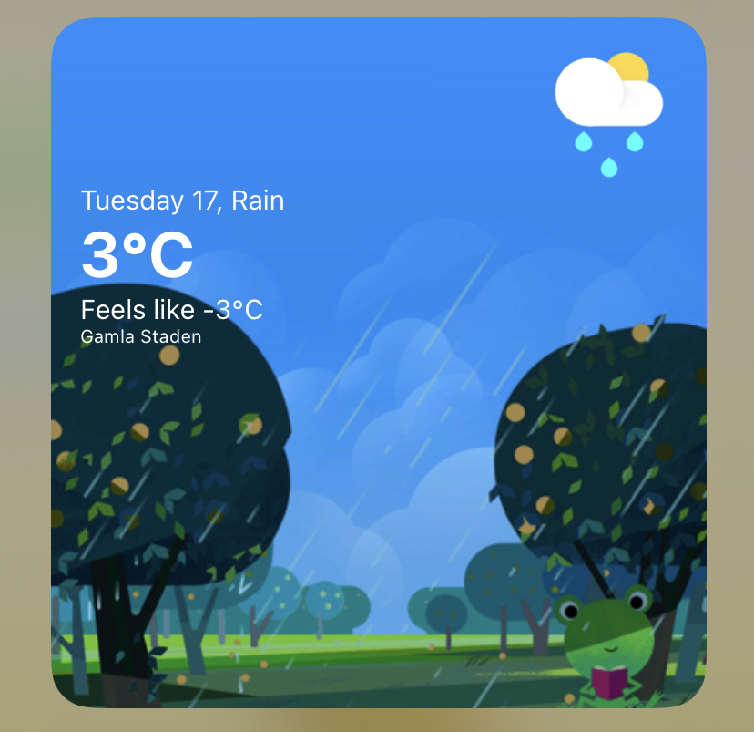

# Froggy Skies
Widget for `Scriptable` with the Google weather frog. Look how happy he is.

## Installation and config
* Register api key at https://openweathermap.org
* Fill out key in `src/constants.ts`.

* Install dependencies with `yarn`.
* Run `yarn build`.
* Build output will be created at `dist/main.js`. You will need to copy the contents in a bit.

* Install `https://scriptable.app` on your phone.
* Create in new script in `Scriptable`, paste contents of `main.js`. Optional: modify `yarn copy` path and transfer through icloud sync.
* Add widget to homescreen.
* Select your script as target.

